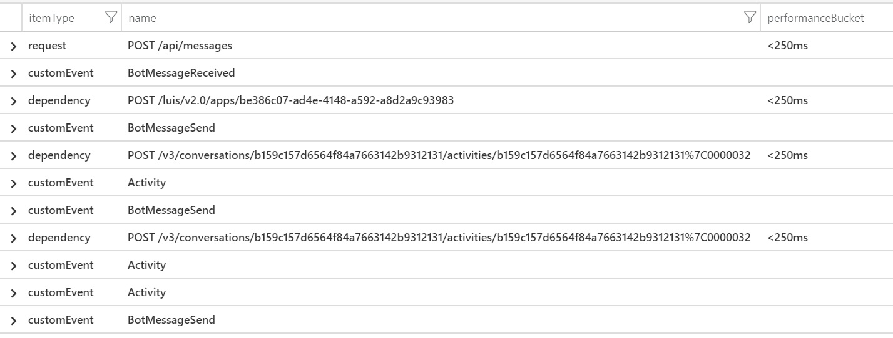

# Telemetry with Bot Framework 4.2

## Summary
In version 4.2 of the Bot Framework SDK, telemetry logging was added into the product.  This enables Bot applications to send event data to services such as Application Insights.

This document covers how to integrate your bot with the new telemetry features.  

## Using Bot Configuration (Option 1 of 2)
There are two methods of configuring your bot.  The first assumes you are integrating with Application Insights.

The bot configuration file contains metadata about external services the Bot uses while running.  For example, CosmosDB, Application Insights and the Language Understanding (LUIS) service connection and metadata is stored here.   

If you want "stock" Application Insights, with no additional Application Insights-specific configuration required (for example Telemetry Initializers), pass in the bot configuration object during initialization.   This is the easiest method to initialize and will configure Application Insights to begin tracking Requests, external calls to other services, and correlating events across services.

>ASP.Net Core - Startup.cs
```csharp
public void ConfigureServices(IServiceCollection services)
{
     ...
     // Add Application Insights - pass in the bot configuration
     services.AddBotApplicationInsights(botConfig);
     ...
public void Configure(IApplicationBuilder app, IHostingEnvironment env)
{
     app.UseBotApplicationInsights()
                 ...
                .UseDefaultFiles()
                .UseStaticFiles()
                .UseBotFramework();
```
>Node.js
```js
const appInsightsClient = new ApplicationInsightsTelemetryClient(botConfig);
```

**No Application Insights in Bot Configuration**
What if your bot configuration doesn't contain Application Insights?  No problem, it defaults to a null client which no-ops the method calls.

**Multiple Application Insights**
Have multiple Application Insight sections in your bot configuration?  You can designate which instance of the Application Insights service you want to use inside your bot configuration.

>ASP.Net Core
```csharp
public void ConfigureServices(IServiceCollection services)
{
     // Add Application Insights
     services.AddBotApplicationInsights(botConfig, "myAppInsights");
```
>Node.js
```js
const appInsightsClient = new ApplicationInsightsTelemetryClient(botConfig);
```


## Overriding the Telemetry Client (Option 2 of 2)

If you want to customize your Application Insights client, or you want to log into a completely separate service, you have to configure the system differently.

**Modify Application Insights Configuration**
> ASP.Net Core
```
csharp
public void ConfigureServices(IServiceCollection services)
{
     ...
     // Create Application Insight Telemetry Client
     // with custom configuration.
     var telemetryClient = TelemetryClient(myCustomConfiguration)
     
     // Add Application Insights
     services.AddBotApplicationInsights(new BotTelemetryClient(telemetryClient), "InstrumentationKey");
```
>Node.js
```js
const appInsightsClient = new ApplicationInsightsTelemetryClient(botConfig);
```

**Use Custom Telemetry**
If you want to log telemetry events generated by the Bot Framework into a completely separate system, create a new class derived from the base interface and configure.  


> ASP.Net Core
```
csharp
public void ConfigureServices(IServiceCollection services)
{
     ...
     // Create my IBotTelemetryClient-based logger
     var myTelemetryClient = MyTelemetryLogger();
     
     // Add Application Insights
     services.AddBotApplicationInsights(myTelemetryClient);
```
>Node.js
```js
const appInsightsClient = new ApplicationInsightsTelemetryClient(botConfig);
```

## Add custom logging to your bot

Once the Bot has the new telemetry logging support configured, you can begin adding telemetry to your bot.  The `BotTelemetryClient`(in C#, `IBotTelemetryClient`) has several methods to log distinct types of events.  Choosing the appropriate type of event enables you to take advantage of Application Insights existing reports (if you are using Application Insights).  For general scenarios `TraceEvent` is typically used.  The data logged using `TraceEvent` lands in the `CustomEvent` table in Kusto.

If using a Dialog within your Bot, every Dialog-based object (including Prompts) will contain a new `TelemetryClient` property.  This is the `BotTelemetryClient` that enables you to perform logging.  This is not just a convenience, we'll see later in this article if this property is set, `WaterfallDialogs` will generate events.


### Identifiers and Custom Events

When logging events into Application Insights, the events generated contain default properties that you won't have to fill.  For example, `user_id` and `session_id`properties are contained in each Custom Event (generated with the `TraceEvent` API).  In addition, `activitiId`, `activityType` and `channelId` are also added.

>Note: Custom telemetry clients will not be provided these values.

Property |Type | Details
--- | --- | ---
`user_id`| `string` | [ChannelID](https://github.com/Microsoft/botframework-obi/blob/master/botframework-activity/botframework-activity.md#channel-id) + [From.Id](https://github.com/Microsoft/botframework-obi/blob/master/botframework-activity/botframework-activity.md#from)
`session_id`| `string`|  [ConversationID](https://github.com/Microsoft/botframework-obi/blob/master/botframework-activity/botframework-activity.md#conversation)
`customDimensions.activityId`| `string` | [The bot activity ID](https://github.com/Microsoft/botframework-obi/blob/master/botframework-activity/botframework-activity.md#id)
`customDimensions.activityType` | `string` | [The bot activity type ](https://github.com/Microsoft/botframework-obi/blob/master/botframework-activity/botframework-activity.md#channel-id)
`customDimensions.channelId` | `string` |  [The bot activity channel ID ](https://github.com/Microsoft/botframework-obi/blob/master/botframework-activity/botframework-activity.md#channel-id)


## WaterfallDialog events

In addition  to generating your own events, the` WaterfallDialog` object within the SDK now generates events. The following section describes the events generated from within the Bot Framework. By setting the `TelemetryClient` property on the `WaterfallDialog` these events will be stored.

### CustomEvent: "WaterfallStart" 

When a WaterfallDialog begins, a `WaterfallStart` event is logged.

- `user_id`  ([From Telemetry Initializer](#identifiers-added-to-custom-events))
- `session_id` ([From Telemetry Initializer](#identifiers-added-to-custom-events))
- `customDimensions.activityId`  ([From Telemetry Initializer](#identifiers-added-to-custom-events))
- `customDimensions.activityType`  ([From Telemetry Initializer](#identifiers-added-to-custom-events))
- `customDimensions.channelId` ([From Telemetry Initializer](#identifiers-added-to-custom-events))
- `customDimensions.DialogId` (This is the dialogId (string) passed into your Waterfall.  You can consider this the "waterfall type")
- `customDimensions.InstanceID` (unique per instance of the dialog)


### CustomEvent: "WaterfallStep" 

Logs individual steps from a Waterfall Dialog.

- `user_id`  ([From Telemetry Initializer](#identifiers-added-to-custom-events))
- `session_id` ([From Telemetry Initializer](#identifiers-added-to-custom-events))
- `customDimensions.activityId`  ([From Telemetry Initializer](#identifiers-added-to-custom-events))
- `customDimensions.activityType`  ([From Telemetry Initializer](#identifiers-added-to-custom-events))
- `customDimensions.channelId` ([From Telemetry Initializer](#identifiers-added-to-custom-events))
- `customDimensions.DialogId` (This is the dialogId (string) passed into your Waterfall.  You can consider this the "waterfall type")
- `customDimensions.StepName` (either method name or `StepXofY` if lambda)
- `customDimensions.InstanceID` (unique per instance of the dialog)


### CustomEvent: "WaterfallDialogComplete"

Logs when a Waterfall Dialog completes.

- `user_id`  ([From Telemetry Initializer](#identifiers-added-to-custom-events))
- `session_id` ([From Telemetry Initializer](#identifiers-added-to-custom-events))
- `customDimensions.activityId`  ([From Telemetry Initializer](#identifiers-added-to-custom-events))
- `customDimensions.activityType`  ([From Telemetry Initializer](#identifiers-added-to-custom-events))
- `customDimensions.channelId` ([From Telemetry Initializer](#identifiers-added-to-custom-events))
- `customDimensions.DialogId` (This is the dialogId (string) passed into your Waterfall.  You can consider this the "waterfall type")
- `customDimensions.InstanceID` (unique per instance of the dialog)


### CustomEvent: "WaterfallDialogCancel" 

Logs when a Waterfall Dialog is canceled.

- `user_id`  ([From Telemetry Initializer](#identifiers-added-to-custom-events))
- `session_id` ([From Telemetry Initializer](#identifiers-added-to-custom-events))
- `customDimensions.activityId`  ([From Telemetry Initializer](#identifiers-added-to-custom-events))
- `customDimensions.activityType`  ([From Telemetry Initializer](#identifiers-added-to-custom-events))
- `customDimensions.channelId` ([From Telemetry Initializer](#identifiers-added-to-custom-events))
- `customDimensions.DialogId` (This is the dialogId (string) passed into your Waterfall.  You can consider this the "waterfall type")
- `customDimensions.StepName` (either method name or `StepXofY` if lambda)
- `customDimensions.InstanceID` (unique per instance of the dialog)


## Events generated by the Bot Framework Service

In addition to `WaterfallDialog`, which generates events from your bot code, the Bot Framework Channel service also logs events.  This helps you diagnose issues with Channels or overall bot failures.

### CustomEvent: "Activity"
**Logged From:** Channel Service
Logged by the Channel Service when a message received.

### Exception: "Bot Errors"
**Logged From:** Channel Service
Logged by the channel when a call to the Bot returns a non-2XX Http Response.


## Additional Events

The [Enterprise Template](https://github.com/Microsoft/AI/tree/master/templates/Enterprise-Template) is open source code that can be freely copied.  This contains several components that can be reused and modified to suit your reporting needs.

### CustomEvent: BotMessageReceived 
**Logged From:** TelemetryLoggerMiddleware (**Enterprise Sample**)

Logged when bot receives new message.

- UserID  ([From Telemetry Initializer](#identifiers-added-to-custom-events))
- ConversationID ([From Telemetry Initializer](#identifiers-added-to-custom-events))
- ActivityID  ([From Telemetry Initializer](#identifiers-added-to-custom-events))
- Channel  ([From Telemetry Initializer](#identifiers-added-to-custom-events))
- ActivityType  ([From Telemetry Initializer](#identifiers-added-to-custom-events))
- Text (Optional for PII)
- FromId
- FromName
- RecipientId
- RecipientName
- ConversationId
- ConversationName
- Locale

### CustomEvent: BotMessageSend 
**Logged From:** TelemetryLoggerMiddleware (**Enterprise Sample**)

Logged when bot sends a message.

- UserID  ([From Telemetry Initializer](#identifiers-added-to-custom-events))
- ConversationID ([From Telemetry Initializer](#identifiers-added-to-custom-events))
- ActivityID  ([From Telemetry Initializer](#identifiers-added-to-custom-events))
- Channel  ([From Telemetry Initializer](#identifiers-added-to-custom-events))
- ActivityType  ([From Telemetry Initializer](#identifiers-added-to-custom-events))
- ReplyToID
- Channel  (Source channel - e.g. Skype, Cortana, Teams)
- RecipientId
- ConversationName
- Locale
- Text (Optional for PII)
- RecipientName (Optional for PII)


### CustomEvent: BotMessageUpdate
**Logged From:** TelemetryLoggerMiddleware
Logged when a message is updated by the bot (rare case)

### CustomEvent: BotMessageDelete~~
**Logged From:** TelemetryLoggerMiddleware
Logged when a message is deleted by the bot (rare case)


### CustomEvent: LuisIntent.INENTName 
**Logged From:** TelemetryLuisRecognizer (**Enterprise Sample**)

Logs results from LUIS service.

- UserID  ([From Telemetry Initializer](#identifiers-added-to-custom-events))
- ConversationID ([From Telemetry Initializer](#identifiers-added-to-custom-events))
- ActivityID  ([From Telemetry Initializer](#identifiers-added-to-custom-events))
- Channel  ([From Telemetry Initializer](#identifiers-added-to-custom-events))
- ActivityType  ([From Telemetry Initializer](#identifiers-added-to-custom-events))
- Intent
- IntentScore
- Question
- ConversationId
- SentimentLabel
- SentimentScore
- *LUIS entities*
- **NEW** DialogId


### CustomEvent: QnAMessage
**Logged From:** TelemetryQnaMaker (**Enterprise Sample**)

Logs results from QnA Maker service.

- UserID  ([From Telemetry Initializer](#identifiers-added-to-custom-events))
- ConversationID ([From Telemetry Initializer](#identifiers-added-to-custom-events))
- ActivityID  ([From Telemetry Initializer](#identifiers-added-to-custom-events))
- Channel  ([From Telemetry Initializer](#identifiers-added-to-custom-events))
- ActivityType  ([From Telemetry Initializer](#identifiers-added-to-custom-events))
- Username
- ConversationId
- OriginalQuestion
- Question
- Answer
- Score (*Optional*: if we found knowledge)


# Querying the data

When using Application Insights, all the data is correlated together (even across services).  We can being by querying a successful request and see all the associated events for that request.  
The following queries will tell you the most recent requests:
```sql
requests 
| where timestamp > ago(3d) 
| where resultCode == 200
| order by timestamp desc
| project timestamp, operation_Id, appName
| limit 10
```

From the first query, select a few `operation_Id`'s and then look for more information:

```sql
let my_operation_id = "<OPERATION_ID>";
let union_all = () {
    union
    (traces | where operation_Id == my_operation_id),
    (customEvents | where operation_Id == my_operation_id),
    (requests | where operation_Id == my_operation_id),
    (dependencies | where operation_Id  == my_operation_id),
    (exceptions | where operation_Id == my_operation_id)
};
union_all
    | order by timestamp asc
    | project itemType, name, performanceBucket
```

This will give you the chronological breakdown of a single request, with the duration bucket of each call.


> Note: The "Activity" `customEvent` event timestamp is out of order, since these events are logged asynchronously.


TODO: Get cleaner sample picture.


