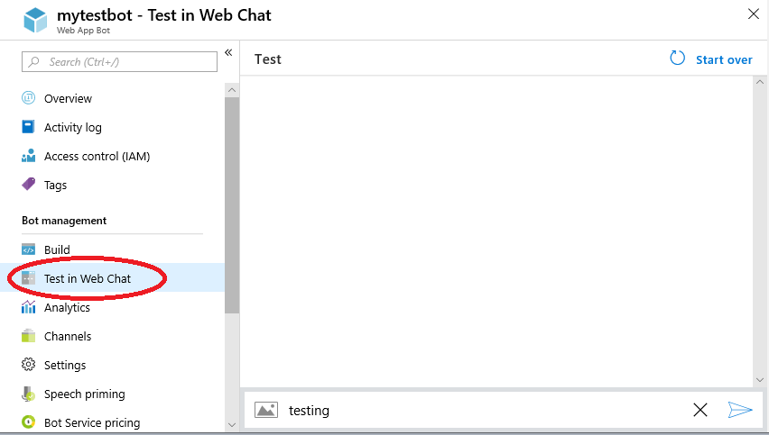

## Bot Configuration Troubleshooting

The first step in troubleshooting a bot is to test it in Web Chat. This will
allow you to determine if the problem is specific to your bot (bot doesn't
work in any channel) or to a particular channel (bot works in some channels
but not others).

### Test in Web Chat

In Azure Portal, click on the "Test in Web Chat" link for your bot, and type
something in the text box:

If the bot responds with the expected output, proceed to [Bot Does Not Work in
Web Chat](#bot-does-not-work-in-web-chat). Otherwise, navigate to [The Bot
Works in Web Chat but not in Other Channels](#the-bot-works-in-web-chat-but-not-in-other-channels).

### Bot Does Not Work in Web Chat

There could be a number of reasons why a bot doesn't work. Most likely, the
bot application is down and cannot receive messages, or the bot receives the
messages but fails to respond.

To see if the bot is running, click on the "Overview" link, copy the Messaging
endpoint and paste it into your browser. If the endpoint returns an error
"This site can't be reached" or "can't reach this page", that means that your
bot is down and you need to redeploy it.

If the endpoint returns HTTP Error 405, that means the bot is reachable and the bot is able to respond to messages. You should investigate whether your bot [times out](troubleshooting_timeout.md) or [fails with an HTTP 5xx error](troubleshooting_500.md).

### The Bot Works in Web Chat but not in Other Channels

If the bot works as expected in Web Chat but fails in some other channel, possible reasons are:

- [Channel Configuration Issues](#channel-configuration-issues)
- [Channel-Specific Behavior](#channel-specific-behavior)
- [Channel Outage](#channel-outage)

#### Channel Configuration Issues

It's possible that channel configuration parameters have been set incorrectly
or have changed externally. For example, a bot has configured the Facebook
channel for a particular page and the page was later deleted. The simplest
solution is remove the channel and redo the channel configuration anew.

The links below provide instructions for configuring the channel supported by
the Bot Framework:

- [Cortana](https://docs.microsoft.com/en-us/azure/bot-service/bot-service-channel-connect-cortana)
- [DirectLine](https://docs.microsoft.com/en-us/azure/bot-service/bot-service-channel-connect-directline)
- [Microsoft Teams](https://docs.microsoft.com/en-us/microsoftteams/platform/concepts/bots/bots-overview)
- [Skype](https://docs.microsoft.com/en-us/azure/bot-service/bot-service-channel-connect-skype)
- [Email](https://docs.microsoft.com/en-us/azure/bot-service/bot-service-channel-connect-email)
- [Kik](https://docs.microsoft.com/en-us/azure/bot-service/bot-service-channel-connect-kik)
- [Telegram](https://docs.microsoft.com/en-us/azure/bot-service/bot-service-channel-connect-telegram)
- [Facebook](https://docs.microsoft.com/en-us/azure/bot-service/bot-service-channel-connect-facebook)
- [Skype for Business](https://docs.microsoft.com/en-us/azure/bot-service/bot-service-channel-connect-skypeforbusiness)
- [Twilio](https://docs.microsoft.com/en-us/azure/bot-service/bot-service-channel-connect-twilio)
- [GroupMe](https://docs.microsoft.com/en-us/azure/bot-service/bot-service-channel-connect-groupme)
- [Slack](https://docs.microsoft.com/en-us/azure/bot-service/bot-service-channel-connect-slack)

#### Channel-Specific Behavior

Implementation of some features differs by channel. For example, not all
channels support Adaptive Cards. Most channels support Buttons, but they are
rendered in a channel-specific way. If you see differences in how some message
types work in different channels, consult the [Channel
Inspector](https://docs.botframework.com/en-us/channel-inspector/channels/Skype).

Below are some additional links that can help with individual channels:

- [Principles of Cortana Skills design](https://docs.microsoft.com/en-us/cortana/skills/design-principles)
- [Add bots to Microsoft Teams apps](https://docs.microsoft.com/en-us/microsoftteams/platform/concepts/bots/bots-overview)
- [Skype for Developers](https://dev.skype.com/bots)
- [Slack: Enabling interactions with bots](https://api.slack.com/bot-users)
- [Facebook: Introduction to the Messenger Platform](https://developers.facebook.com/docs/messenger-platform/introduction)

#### Channel Outage

Occasionally, some channels might have an interruption of service. Usually,
such outages don't last long. However, if you suspect an outage, consult a
channel web site or social media.

Another way to determine if a channel has an outage is to create a test bot
(such as a simple Echo Bot) and add a channel. If the test bot works with some
channels but not others, that would indicate that the problem is not in your
production bot.
